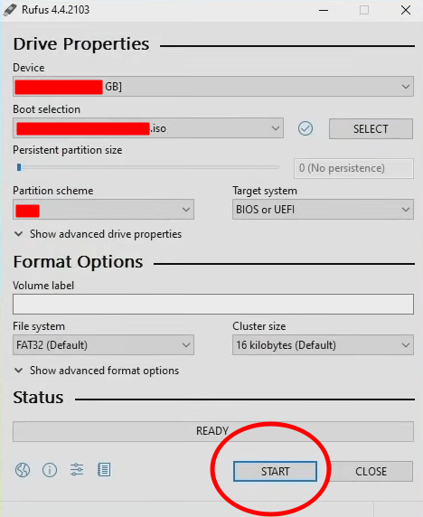
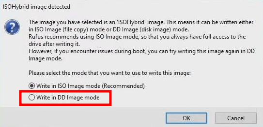
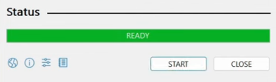
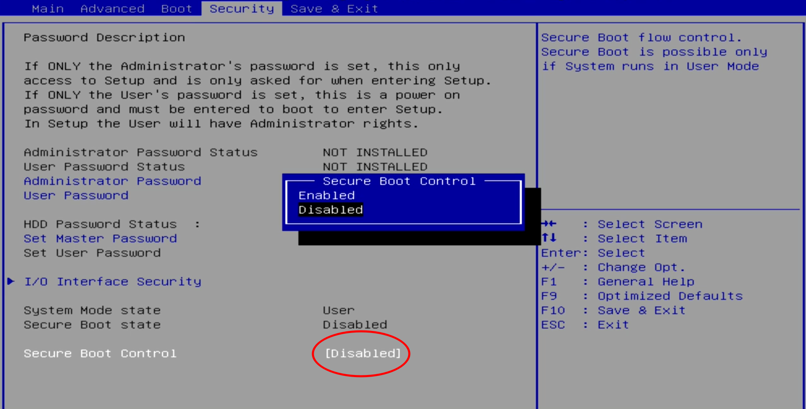
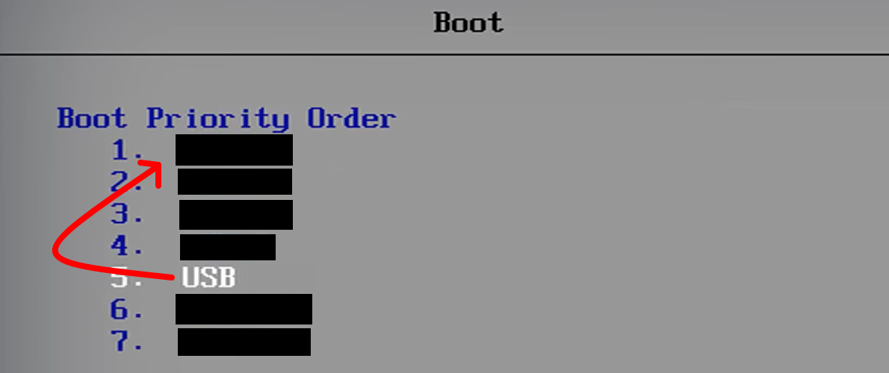
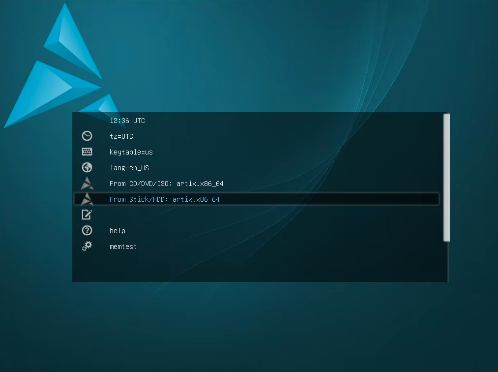
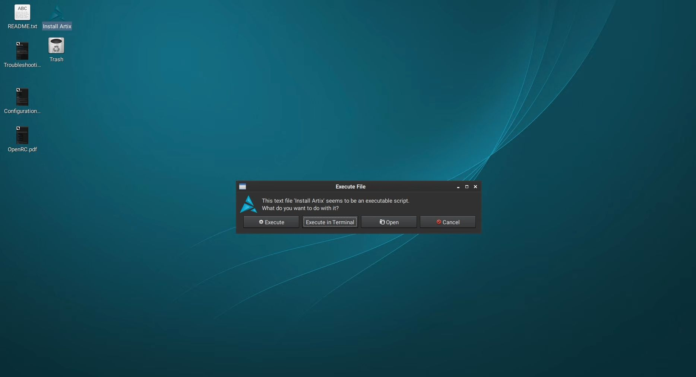
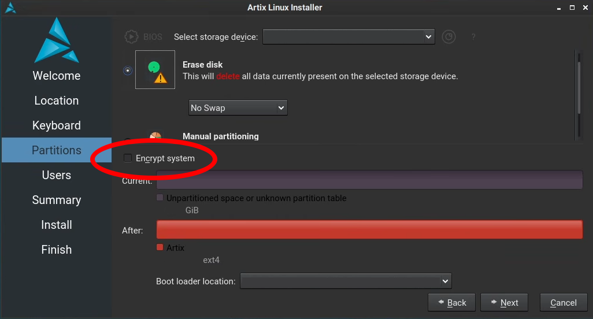
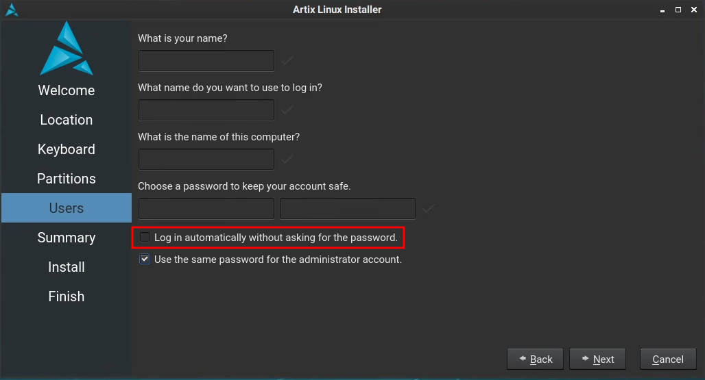

# Artix Linux installation guide for beginners

## Requirements
* USB flash drive (at least 4 GB of storage)
* Windows PC
* Rufus (software, free to download: https://rufus.ie/en/)
* Artix Linux installation file (.ISO file)

## Step 1: Download Artix Linux ISO

Visit Artix Linux website for downloads: https://artixlinux.org/

There are different init systems and desktop environments available. Please note that `base` version doesn't have desktop environment pre-installed.

Information about desktop environments: https://en.wikipedia.org/wiki/Desktop_environment 

Information about init systems: https://en.wikipedia.org/wiki/Init

## Step 2: Create bootable USB drive with Rufus

It takes a few minutes to create a bootable USB drive.

In Rufus, choose the following settings:
* Device: Choose your USB drive.
* Boot selection: Choose the Artix ISO on your computer.
* Partition scheme: Choose GPT. With older hardware, choose MBR. (If the installation doesn't work, change this later)
* Leave everything else with default settings and choose "Start".

When the program asks, choose "DD". (If the installation doesn't work, change this later)

You can close the program and remove the USB drive when the process is finished ("Ready").

FAQ: https://github.com/pbatard/rufus/wiki/FAQ

## Step 3: Boot from the USB drive

Insert the bootable USB drive to the computer.

To enter the BIOS/UEFI settings, keep pressing Esc/Delete keys rapidly during the initial boot process until you see BIOS/UEFI settings.

First, disable secure boot. (Please note that BIOS/UEFI menus may look different.)

Change the boot order in "Boot" section to boot from USB drive first.

Save the changes and exit. Computer restarts. If you did everything correctly, the computer boots from USB drive.

### Troubleshooting

In case you faced problems, there may be several reasons for failed boot process:
* Boot order wasn't saved correctly in BIOS/UEFI settings. Change the settings and try again.
* Secure boot wasn't disabled. Disable it and try again.
* USB port doesn't work. Change the USB port.
* Installation media was created with wrong settings in Rufus. Change the settings in Rufus and try again.

## Step 4: Artix Linux installer

During the boot screen, choose "From Stick/HDD".

On the desktop, click "Install Artix" icon. If the system asks, choose "Execute".

Follow the instructions in the installer.

## Step 5: (Optional) Disk encryption

To protect your files, it is recommended to encrypt your storage. With the installer, it's very easy.

Choose "Encrypt system" and enter a password twice. This password is being asked every time you boot your computer. Please note that the computer may be slighly slower with disk encryption enabled, so it may not be the best option for high-performance gaming computer.

If disk encryption is enabled, it's useful to enable automatic login, because it's unnecessary to enter two passwords in a row during the boot.

## Step 6: Ready

When the installation is finished, close the installer and shut down the computer from the main menu. When the computer is shut down, remove the USB drive and restart the computer.

If everything went as planned, computer boots to desktop with a fresh Artix Linux install.

If you changed the boot order permanently in BIOS/UEFI, you may want to revert the BIOS/UEFI boot settings. However, this is not necessary if the computer boots normally from now on.
